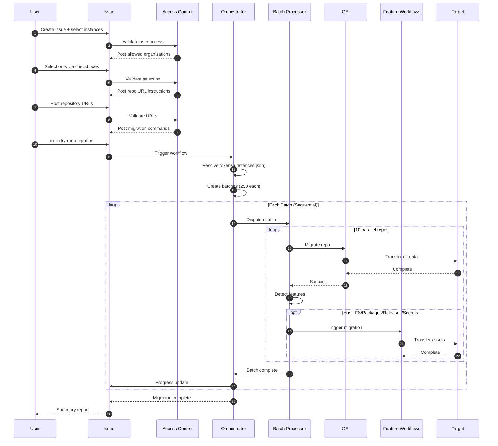

# 🚀 GitHub Self-Service Migration Framework

> **Empower Your Users to Migrate Their Own Repositories**

[](https://github.com)
[](https://docs.github.com/en/migrations/using-github-enterprise-importer)
[](https://github.com)

**Free your admins from migration bottlenecks.** This framework enables GitHub users to migrate their own repositories through a guided, self-service workflow—while maintaining enterprise-grade security, access controls, and governance.

Built on GitHub Enterprise Importer (GEI) with intelligent batching, parallel processing, and comprehensive asset transfer. Supports GHES-to-GHEC, GHEC-to-GHEC, and EMU migrations with role-based access control, dry-run validation, and automatic feature detection.

---

## 📚 Documentation

| Document | Description |
|----------|-------------|
| 📖 [README.md](README.md) | Framework overview, features, and architecture (you are here) |
| 🛠️ [SETUP.md](SETUP.md) | Complete setup guide from prerequisites to first migration |
| 🚀 [USAGE.md](USAGE.md) | How to run migrations with the 4-step guided workflow |
| 🔄 [UPDATING.md](UPDATING.md) | Keep your framework up-to-date with latest features |

**New to this framework?** Start with [SETUP.md](SETUP.md) for step-by-step installation and configuration.

**Ready to migrate?** See [USAGE.md](USAGE.md) for the complete migration workflow.

**Using this as a template?** See [UPDATING.md](UPDATING.md) for how to receive framework updates while preserving your configuration.

---

## ✨ Key Features

### 🙋 Self-Service Empowerment

| Feature | Description | Benefit |
|---------|-------------|---------|
| 📝 **Issue-Driven Workflow** | Users create migration requests through GitHub Issues | No admin bottleneck—users own their migrations |
| 🔐 **Role-Based Access Control** | Fine-grained permissions per organization via `instances.json` | Users only see what they're authorized to migrate |
| 🧪 **Safe Testing** | Dry-run mode validates before production | Users can test migrations risk-free |
| 📊 **Real-Time Visibility** | Progress updates posted automatically to issues | Complete transparency—no "black box" migrations |

### ⚙️ Enterprise-Grade Automation

| Feature | Description |
|---------|------------|
| 🏢 **Multi-Instance Architecture** | Support for multiple GHES and GHEC instances with centralized configuration |
| 📦 **Smart Batching** | Automatically splits large migrations into 250-repo chunks (configurable to 256 max) |
| ⚡ **Parallel Execution** | Up to 10 concurrent repository migrations per batch (GEI limit) |
| 🔄 **Sequential Processing** | Reliable batch-by-batch execution with comprehensive progress tracking |
| 💾 **Complete Data Transfer** | Git history, LFS, packages, releases, secrets, variables, and environments |
| 🔒 **Production Mode** | Secure migration with automatic source repository locking |
| 👥 **User Mapping** | Automatic mannequin-to-user account mapping with CSV support |
| 🧹 **Cleanup Tools** | Commands for dry-run cleanup and repository deletion |
| 🛑 **Cancellation Support** | Stop migrations gracefully with `/cancel-migration` command |

## 🎯 Quick Start

> **First time setup?** Follow the complete [SETUP.md](SETUP.md) guide for detailed installation instructions.

### 📋 Prerequisites

**For Admins (One-Time Setup):**
- ✅ GitHub Enterprise Cloud organization (target)
- ✅ Admin access to source and target instances
- ✅ Self-hosted GitHub Actions runners (Ubuntu 24.04, 16+ cores, 32GB+ RAM)
- ✅ Cloud storage (Azure Blob or AWS S3) for GEI backend
- ✅ Configure `instances.json` with organizations and authorized users

**For Users (Self-Service Migration):**
- ✅ GitHub account with access granted in `instances.json`
- ✅ Knowledge of which repositories to migrate
- ✅ Ability to create issues in the migration framework repository

**📖 Complete setup guide:** See [SETUP.md](SETUP.md) for step-by-step installation instructions.

## 🚀 Running Migrations

Once your framework is set up, **users can migrate their own repositories** using the **4-step guided workflow**:

1. **Create Migration Issue** - Select source and target instances
2. **Select Organizations** - Choose which orgs to migrate between  
3. **Provide Repository URLs** - List the repositories to migrate
4. **Execute Migration** - Run dry-run test or production migration

The system provides real-time progress updates and handles batching, parallelization, and feature detection automatically—**no admin intervention required**.

**📖 Complete migration guide:** See [USAGE.md](USAGE.md) for detailed instructions.

### Quick Commands

| Command | Purpose |
|---------|---------|
| `/run-dry-run-migration` | Test migration safely (recommended first) |
| `/run-production-migration` | Execute production migration |
| `/delete-dry-run` | Clean up dry-run test repositories |
| `/cancel-migration` | Stop an ongoing migration |

## 🏗️ Architecture

## 🖥️ Actions Runner Setup

**CRITICAL**: This system requires self-hosted GitHub Actions runners for batch processing. GitHub-hosted runners are only used for orchestration.

### **Runner Architecture Overview**

The migration system uses a three-tier runner architecture:

```
┌─────────────────────────────────────────────────────┐
│  Tier 1: Orchestration (GitHub-hosted)              │
│  ├─ Creates batches                                 │
│  ├─ Dispatches workflows                            │
│  └─ Posts progress updates                          │
└─────────────────────────────────────────────────────┘
                        ↓
┌─────────────────────────────────────────────────────┐
│  Tier 2: Batch Processing (Self-hosted)             │
│  ├─ Runs GEI migrations (10 parallel)               │
│  ├─ Detects features (LFS, packages, etc.)          │
│  └─ Triggers feature migrations                     │
└─────────────────────────────────────────────────────┘
                        ↓
┌─────────────────────────────────────────────────────┐
│  Tier 3: Feature Migrations (Self-hosted)           │
│  ├─ LFS data transfer                               │
│  ├─ Packages migration                              │
│  ├─ Releases migration                              │
│  ├─ Secrets/Variables migration                     │
│  └─ Environments migration                          │
└─────────────────────────────────────────────────────┘
```

### **Runner Requirements**

| Component | Runner Type | Quantity | Purpose |
|-----------|-------------|----------|---------|
| **Orchestrator** | Self-hosted | **1** | Batch creation, sequencing, progress updates |
| **Batch Processing** | Self-hosted | **1-10** | GEI repository migrations (10 for max concurrency) |
| **Feature Migrations** | Self-hosted | 0-10+ | LFS, packages, releases, environments |

**Total Runners for Full Concurrency:** 11 (1 orchestrator + 10 batch processors)

### **Deployment Options**

**Option 1: Single Server (Recommended for most)**
```
Server: Ubuntu 24.04, 32 cores, 64GB RAM, 1TB SSD
└─ 11 runner processes (all labeled: self-hosted)
   ├─ 1 runner: Orchestration
   ├─ 10 runners: Batch processing (max concurrency)
   └─ Shared /opt/migration cache directory
```

**📖 For complete runner installation instructions:** See [SETUP.md - Set Up Self-Hosted Runners](SETUP.md#️-set-up-self-hosted-runners)

## 💾 Storage & Caching

### **GEI Storage Backend** (Required)

GEI requires cloud storage for temporary migration data:

| Backend | Configuration | When to Use |
|---------|--------------|-------------|
| **Azure Blob** | `AZURE_STORAGE_CONNECTION_STRING` secret | Azure infrastructure |
| **AWS S3** | `AWS_ACCESS_KEY_ID` + `AWS_SECRET_ACCESS_KEY` secrets<br>`AWS_REGION` + `AWS_BUCKET_NAME` variables | AWS infrastructure |

### **Local Cache Directory** (Optional but Recommended)

**Location:** `/opt/migration` (configurable via `LOCAL_CACHE_DIR` variable)

**Purpose:** Speeds up feature detection and migration by caching:
- Package metadata
- Release data
- Environment configurations
- LFS detection results

**Who needs it:** Self-hosted runners running batch processing and feature migrations

**📖 For complete storage setup:** See [SETUP.md - Configure Storage Backend](SETUP.md#️-configure-storage-backend)

## 🎛️ Advanced Configuration

### ⚙️ Batch Size Configuration

Control how many repositories are processed per batch:

**Location**: `.github/workflows/trigger.yml`

```yaml
with:
  BATCH_SIZE: 250  # Default: 250, Max: 256 (GitHub Actions matrix limit)
```

**Considerations:**
- Larger batches = fewer sequential batch executions
- Maximum is 256 (GitHub Actions matrix size limit)
- Batch size doesn't affect parallelism (always max 10 concurrent per batch)

### 🔄 Parallel Processing Configuration

Control concurrent migrations per batch:

**Location**: `.github/workflows/batch-processor.yml`

```yaml
strategy:
  max-parallel: 10  # GEI hard limit, do not exceed
```

**Important**: 
- ⚠️ **Do not exceed 10** - this is a GEI CLI limitation
- Each parallel job migrates one repository
- With 10 runners + max-parallel: 10, you get full parallelization

### ⏱️ Timeout Configuration

For large repositories or slow networks:

**Location**: `.github/workflows/batch-processor.yml`

```yaml
timeout-minutes: 50400  # 35 days (GitHub Actions maximum)
```

**Guidelines:**
- Default: 50400 minutes (35 days)
- Adjust based on largest repository size
- Includes time for LFS transfers and feature migrations

### 🌐 Multi-Instance Configuration

Add additional GitHub instances to `instances.json`:

```json
{
  "sources": {
    "GHES-PROD": {
      "hostname": "ghes-prod.company.com",
      "tokenSecret": "GHES_PROD_TOKEN",
      "orgs": {...}
    },
    "GHES-DEV": {
      "hostname": "ghes-dev.company.com",
      "tokenSecret": "GHES_DEV_TOKEN",
      "orgs": {...}
    },
    "GHEC-ORG1": {
      "hostname": "github.com",
      "tokenSecret": "GHEC_ORG1_TOKEN",
      "orgs": {...}
    }
  },
  "targets": {
    "GHEC-EMU-PROD": {...},
    "GHEC-EMU-TEST": {...}
  }
}
```

**Then update the issue template** (`.github/ISSUE_TEMPLATE/gei-batch-migrations.yml`):

```yaml
- type: dropdown
  id: source-instance
  attributes:
    label: 🏠 Source Instance
    options:
      - "GHES-PROD"
      - "GHES-DEV"
      - "GHEC-ORG1"
```

### 🔐 Variables & Secrets Migration

**Fully automated** - no configuration needed!

**How it works:**
1. ✅ Batch processor detects repository variables and secrets
2. ✅ Triggers variables-secrets.yml workflow automatically
3. ✅ Migrates variables with actual values
4. ⚠️ Creates placeholder secrets (security requirement)

**Post-migration:**
- Review placeholder secrets: `https://github.com/TARGET_ORG/REPO/settings/secrets/actions`
- Update with actual values manually
- Verify variables migrated correctly

**Security Note**: GitHub API doesn't allow reading secret values, only names. Placeholders must be manually updated.

### 🌍 Environments Migration

**Fully automated** - environments are detected and migrated automatically!

**What's Migrated:**
- ✅ Environment names and settings
- ✅ Protection rules (wait timers, required reviewers)
- ✅ Deployment branch policies
- ✅ Custom protection rules
- ⚠️ Environment secrets (as placeholders, like repo secrets)

**Prerequisites:**
- Target repositories must exist (✅ done via main migration)
- Environments CSV must be in cache (✅ auto-generated or pre-cached)

**Verification:**
Check migrated environments at: `https://github.com/TARGET_ORG/REPO/settings/environments`

### 📦 Feature-Specific Configuration

**LFS Migration:**
- Detected automatically via `.gitattributes` file
- Optional: Pre-populate `${LOCAL_CACHE_DIR}/${ORG}_lfs.csv` for tracking
- Uses `gh-migrate-lfs` tool

**Packages Migration:**
- Detected from cached package exports
- Requires `LOCAL_CACHE_DIR` with package CSV files
- Supports: npm, Maven, NuGet, Docker, RubyGems

**Releases Migration:**
- Detected from cached release data in `LOCAL_CACHE_DIR`
- Migrates: Release notes, assets, tags
- Preserves: Draft status, prerelease flags

### 🎨 Customizing Visibility Logic

**Default behavior**: Set via issue template dropdown

**Advanced**: Modify `batch-processor.yml` for custom logic:

```yaml
env:
  VISIBILITY: ${{ github.event.client_payload.batch.targetRepositoryVisibility }}
```

**Options**:
- `Private` - All migrated repos are private
- `Internal` - All repos are internal (requires EMU or GHEC)
- `Mirror` - Preserves source visibility (custom implementation required)

## 🛠️ Troubleshooting

### 🚨 Common Issues & Solutions

<details>
<summary>🔴 <strong>Migration Won't Start</strong></summary>

**Symptoms:**
- No response after posting migration command
- Workflows don't trigger

**Checklist:**
1. ✅ Verify you completed all 4 steps of the guided workflow
2. ✅ Check PAT permissions (must include `repo`, `admin:org`, `workflow`)
3. ✅ Ensure secrets names match `instances.json` tokenSecret values
4. ✅ Confirm issue has `migration` and `batch` labels
5. ✅ Verify at least 1 self-hosted runner is online
6. ✅ Check Actions tab for workflow errors

**Debug Commands:**
```bash
# Verify secrets are configured
gh secret list --repo YOUR-ORG/migraction

# Check runner status
# Go to: https://github.com/YOUR-ORG/migraction/settings/actions/runners
```

</details>

<details>
<summary>🟡 <strong>Batch Processing Stops or Times Out</strong></summary>

**Symptoms:**
- Batch workflow starts but doesn't complete
- "Job was cancelled" errors

**Steps:**
1. Check **Actions tab** → Select failed workflow → Review logs
2. Verify runner availability:
   - Go to Settings → Actions → Runners
   - Ensure runners show "Idle" (green) not "Offline" (gray)
3. Check runner logs on the server:
   ```bash
   # View runner logs
   cat ~/actions-runner-1/_diag/Runner_*.log
   ```
4. Verify GEI CLI is installed:
   ```bash
   gei --version
   # If not found, set INSTALL_PREREQS=true
   ```
5. Check API rate limits:
   ```bash
   gh api rate_limit --token $YOUR_TOKEN
   ```
6. Re-run failed batch from Actions tab

</details>

<details>
<summary>🔵 <strong>Features Not Migrating (LFS/Packages/Releases)</strong></summary>

**Symptoms:**
- Main migration succeeds but features missing
- No LFS objects, packages, or releases in target

**Diagnosis:**

1. **Check if features were detected:**
   - Go to Actions → Batch workflow logs
   - Look for "Detect features requiring additional migration steps"
   - Check output: `lfs=true`, `packages=true`, `releases=true`

2. **Verify LOCAL_CACHE_DIR:**
   ```bash
   # On runner machine
   ls -la /opt/migration/
   # Should contain: packages/, releases/, *_environments.csv
   ```

3. **Check feature workflow triggering:**
   - Go to Actions → Filter by workflow (lfs.yml, packages.yml, etc.)
   - Verify workflows were dispatched

4. **Pre-cache data** (recommended for large migrations):
   ```bash
   # Use gh-migrate-* tools to pre-populate cache
   gh extension install mona-actions/gh-migrate-releases
   gh migrate-releases export --source-org ORG --cache-dir /opt/migration
   ```

</details>

<details>
<summary>🟠 <strong>Access Denied or Authorization Errors</strong></summary>

**Symptoms:**
- "User does not have access" message
- Organization checkboxes don't appear
- "Unknown source instance" errors

**Resolution:**

1. **Verify user is in allowedUsers:**
   ```json
   // Check .github/scripts/config/instances.json
   {
     "sources": {
       "GHES": {
         "orgs": {
           "engineering": {
             "allowedUsers": ["YOUR-USERNAME", "..."]
           }
         }
       }
     }
   }
   ```

2. **Validate instances.json:**
   ```bash
   node .github/scripts/config/validate.js
```3. **Check secret names match:**
   - Instance config: `"tokenSecret": "GHES_PROD_TOKEN"`
   - GitHub Secret: Must be named exactly `GHES_PROD_TOKEN`

</details>

<details>
<summary>🟣 <strong>Secrets/Variables Not Migrating Correctly</strong></summary>

**Expected Behavior:**
- ✅ Variables: Migrate with actual values
- ⚠️ Secrets: Migrate as placeholders (security limitation)

**Why?**
GitHub API doesn't allow reading secret values, only names. This is by design for security.

**Post-Migration Actions:**
1. Go to target repo: `https://github.com/TARGET_ORG/REPO/settings/secrets/actions`
2. Update each placeholder secret with actual value
3. Verify variables at: `https://github.com/TARGET_ORG/REPO/settings/variables/actions`

</details>

<details>
<summary>⚫ <strong>Runner Out of Disk Space</strong></summary>

**Symptoms:**
- "No space left on device" errors
- LFS migrations fail
- Workflows crash unexpectedly

**Resolution:**

1. **Check disk usage:**
   ```bash
   df -h /opt/migration
   du -sh /opt/migration/*
   ```

2. **Clean up old migrations:**
   ```bash
   # Remove old cache data
   sudo rm -rf /opt/migration/old-migration-*
   
   # Clean up GEI archives
   sudo find /opt/migration -name "*.tar.gz" -mtime +7 -delete
   ```

3. **Increase disk space** or move cache:
   ```bash
   # Option 1: Mount larger volume to /opt/migration
   
   # Option 2: Change LOCAL_CACHE_DIR variable to new location
   # Settings → Variables → LOCAL_CACHE_DIR → /mnt/large-disk/migration
   ```

4. **Stagger migrations:** Run smaller batches to reduce concurrent disk usage

</details>

### 🛑 Emergency Controls

**Stop an ongoing migration:**
```
/cancel-migration
```
Posts comment to issue, workflows must be manually cancelled in Actions tab.

**Clean up dry-run repositories:**
```
/delete-dry-run
```
⚠️ Use carefully - permanently deletes all repositories with dry-run naming patterns.

**Delete specific repositories:**
```
/delete-repositories
```
⚠️ DANGEROUS - Requires confirmation, permanently deletes repositories.

**Re-run a specific failed batch:**
1. Go to **Actions** tab
2. Find the failed batch workflow (e.g., "Migration Batch 3")
3. Click **"Re-run failed jobs"** or **"Re-run all jobs"**
4. Monitor progress in issue comments

### 📋 Debugging Checklist

Before opening a support issue, collect:

```markdown
**Environment:**
- [ ] Number of repositories: ___
- [ ] Source instance: GHES / GHEC / Other
- [ ] Target instance: GHEC / GHEC EMU
- [ ] Number of self-hosted runners: ___
- [ ] Runner OS: Linux / Windows / macOS

**Configuration:**
- [ ] INSTALL_PREREQS value: ___
- [ ] BATCH_SIZE: ___
- [ ] max-parallel: ___
- [ ] Storage backend: Azure / AWS

**Issue Details:**
- [ ] Workflow run URL: ___
- [ ] Error messages: ___
- [ ] Issue number: #___
- [ ] Batch number (if applicable): ___

**Logs:**
- [ ] Attached workflow logs (Actions → Select run → Download logs)
- [ ] Runner logs (if available)
```

### 🔍 Advanced Debugging

**Enable verbose logging:**

Edit `.github/workflows/batch-processor.yml`:

```yaml
- name: Execute GEI migration
  run: |
    # Add --verbose flag
    gei migrate-repo \
      --verbose \
      --github-source-org $SOURCE_ORG \
      ...
```

**Test GEI manually:**
```bash
# Test single repository migration
gei migrate-repo \
  --github-source-org source-org \
  --source-repo test-repo \
  --github-target-org target-org \
  --target-repo test-repo \
  --github-source-pat $SOURCE_TOKEN \
  --github-target-pat $TARGET_TOKEN
```

**Validate token permissions:**
```bash
# Test source token
gh auth status --hostname ghes.company.com

# Test target token
gh auth status

# Check org access
gh api /orgs/YOUR-ORG --hostname ghes.company.com
```

## 📊 Architecture & Workflow

### **System Architecture**

```
┌─────────────────────────────────────────────────────────────┐
│  End Users (Self-Service Interface)                         │
│  ├─ Create migration issue via GitHub UI                    │
│  ├─ Select source/target organizations (filtered by access) │
│  ├─ Provide repository URLs to migrate                      │
│  ├─ Execute migrations with simple commands                 │
│  └─ Monitor progress in real-time                           │
└─────────────────────────────────────────────────────────────┘
                           ↓
┌─────────────────────────────────────────────────────────────┐
│  Access Control & Validation (instances.json)               │
│  ├─ Filters organizations by user permissions               │
│  ├─ Validates source/target configuration                   │
│  ├─ Ensures repos match selected organization               │
│  └─ Enforces role-based access control                      │
└─────────────────────────────────────────────────────────────┘
                           ↓
┌─────────────────────────────────────────────────────────────┐
│  Orchestrator (GitHub-hosted: ubuntu-latest)                │
│  ├─ Resolves tokens from instances.json config              │
│  ├─ Creates batches (250 repos each)                        │
│  ├─ Dispatches batches sequentially                         │
│  └─ Posts progress updates to issue                         │
└─────────────────────────────────────────────────────────────┘
                           ↓
┌─────────────────────────────────────────────────────────────┐
│  Batch Processor (Self-hosted: 1-10 runners)                │
│  ├─ Parallel execution (max 10 concurrent)                  │
│  ├─ GEI repository migration                                │
│  ├─ Feature detection (LFS, packages, releases, etc.)       │
│  └─ Triggers feature migrations                             │
└─────────────────────────────────────────────────────────────┘
                           ↓
┌─────────────────────────────────────────────────────────────┐
│  Feature Migrations (Self-hosted: 0-10+ runners)            │
│  ├─ Variables & Secrets → variables-secrets.yml             │
│  ├─ LFS Objects → lfs.yml                                   │
│  ├─ Packages → packages.yml                                 │
│  ├─ Releases → releases.yml                                 │
│  └─ Environments → environments.yml                         │
└─────────────────────────────────────────────────────────────┘
                           ↓
┌─────────────────────────────────────────────────────────────┐
│  Reporting & Completion                                     │
│  ├─ Batch status updates posted to issue                    │
│  ├─ Feature migration reports                               │
│  ├─ Final summary with statistics                           │
│  └─ Next steps and post-migration checklist                 │
└─────────────────────────────────────────────────────────────┘
```

### **Why Self-Service?**

**For Admins:**
- 🎯 **Eliminate bottlenecks**: No more fielding individual migration requests
- ⏰ **Save time**: Users handle their own migrations
- 🔐 **Maintain control**: Define who can migrate what via `instances.json`
- 📊 **Full visibility**: Monitor all migrations from Actions tab
- 🛡️ **Security maintained**: Token security, access controls, and audit trails

**For Users:**
- 🚀 **Move at your pace**: Migrate when it's convenient for you
- 🧪 **Test safely**: Dry-run migrations before production
- 👀 **Complete transparency**: Real-time progress in your issue
- 🎯 **Simple process**: Guided 4-step workflow
- 📝 **Self-documented**: Issue comments provide automatic audit trail

### **Migration Flow Diagram**



### **Key Workflows**

| Workflow | Trigger | Runner Type | Purpose |
|----------|---------|-------------|---------|
| **prepare.yml** | Issue opened/edited | `ubuntu-latest` | Parse issue, validate access, post org selection |
| **on-checkbox-edit.yml** | Issue comment created/edited | `ubuntu-latest` | Detect org selection, post Step 3 |
| **parse-repos.yml** | Issue comment | `ubuntu-latest` | Parse repository URLs, post Step 4 |
| **trigger.yml** | Issue comment (`/run-*-migration`) | `ubuntu-latest` | Validate setup, trigger orchestrator |
| **orchestrator.yml** | Called by trigger.yml | `ubuntu-latest` | Create batches, dispatch sequentially |
| **batch-processor.yml** | Repository dispatch | **`self-hosted`** | Run GEI migrations (10 parallel) |
| **variables-secrets.yml** | Workflow dispatch | **`self-hosted`** | Migrate repo variables & secrets |
| **lfs.yml** | Workflow dispatch | **`self-hosted`** | Migrate LFS objects |
| **packages.yml** | Workflow dispatch | **`self-hosted`** | Migrate packages |
| **releases.yml** | Workflow dispatch | **`self-hosted`** | Migrate releases |
| **environments.yml** | Workflow dispatch | **`self-hosted`** | Migrate deployment environments |
| **delete.yml** | Issue comment (`/delete-*`) | `ubuntu-latest` | Cleanup workflows |

### **Data Flow**

```
┌──────────────────┐
│  instances.json  │ ← Configuration: instances, orgs, users, tokens
└────────┬─────────┘
         │
         ↓
┌──────────────────┐
│  GitHub Secrets  │ ← Tokens: GHES_PROD_TOKEN, GHEC_EMU_TOKEN, etc.
└────────┬─────────┘
         │
         ↓
┌──────────────────┐
│  Orchestrator    │ ← Resolves tokens, creates batches
└────────┬─────────┘
         │
         ↓
┌──────────────────┐
│  Batch Dispatch  │ ← repository_dispatch event with payload
└────────┬─────────┘
         │
         ↓
┌──────────────────┐
│ Batch Processor  │ ← Receives: repos, tokens, org names
└────────┬─────────┘
         │
         ├──→ GEI CLI ──→ Cloud Storage (Azure/S3) ──→ Target Repo
         │
         └──→ Feature Detection ──→ LOCAL_CACHE_DIR (/opt/migration)
                  │
                  └──→ Trigger Feature Workflows
```

### **Performance Metrics**

> ⚠️ **Important**: These are general guidelines only. Actual migration times vary greatly based on repository size, complexity, commit history, LFS data, and network conditions. **Always run a dry-run migration first** to get accurate timing for your specific repositories.

| Scale | Repositories | Batches | Est. Time | Workers |
|-------|-------------|---------|-----------|---------|
| **Small** | 1-50 | 1 | 5-50 min | 10 parallel |
| **Medium** | 51-250 | 1 | 50-250 min | 10 parallel |
| **Large** | 251-1000 | 4 | 4-17 hours | 10 parallel |
| **Enterprise** | 1001-5000 | 20 | 17-84 hours | 10 parallel |

**Time Calculation:**
```
Total Time = (Total Repos ÷ 10 parallel) × Avg Time per Batch
           + (Number of Batches × Batch Overhead)

Where:
- 10 repos in parallel: ~10 minutes (average-sized repos)
- Avg per repo: ~1 minute when running 10 parallel
- Batch Overhead: ~2 minutes per batch
- Large/complex repos: May take significantly longer
- LFS repos: Add 30+ minutes depending on data volume
```

**Factors Affecting Performance:**
- 🔢 Repository size and complexity
- 💾 LFS data volume
- 📦 Number of packages
- 🌐 Network bandwidth
- 🖥️ Runner specifications
- ⚡ Whether data is pre-cached

## 🔒 Security Best Practices

### 🛡️ Token Security

**PAT Management:**
- 🔑 Store all tokens in GitHub Secrets (never in code or config files)
- 🔄 Rotate tokens after each major migration
- 📅 Set token expiration dates (recommended: 90 days)
- 🎯 Use minimum required permissions (see [Setup](#3️⃣-configure-github-secrets-))
- 👥 Create service account tokens (don't use personal tokens)

**Required Scopes:**
```
repo                   # Full control of repositories
admin:org              # Full control of orgs and teams  
workflow               # Update GitHub Actions workflows
```

**Token Storage Pattern:**
```json
// instances.json references secret names:
"tokenSecret": "GHES_PROD_TOKEN"

// Actual token stored in GitHub Secrets:
Settings → Secrets → Actions → GHES_PROD_TOKEN = "ghp_xxxxxxxxxxxx"
```

### 👥 Access Control

**Role-Based Access via instances.json:**

```json
{
  "sources": {
    "GHES": {
      "orgs": {
        "sensitive-org": {
          "allowedUsers": ["admin1", "admin2"]  // Restricted access
        },
        "general-org": {
          "allowedUsers": ["admin1", "admin2", "dev-team", "migration-team"]
        }
      }
    }
  }
}
```

**Best Practices:**
- 🔐 Limit `allowedUsers` to minimum necessary personnel
- 👥 Create dedicated migration teams
- 📋 Use groups or team names (document mapping separately)
- 🔄 Review access quarterly
- 📝 Audit who has modified instances.json (git history)

**During Migration:**
- 🚪 Restrict issue creation to authorized teams
- 🔒 Production migrations lock source repositories
- 👁️ Monitor Actions workflow runs
- 📊 Review migration logs for anomalies

### 💾 Data Handling

**In-Flight Data:**
- 🗄️ GEI uses cloud storage (Azure/S3) for temporary archives
- 🔒 Ensure storage accounts use encryption at rest
- 🌐 Use private endpoints for storage (if available)
- ⏰ Configure lifecycle policies to auto-delete old archives (30 days)

**Local Cache (`/opt/migration`):**
- 📁 Contains metadata and feature exports (not full repo data)
- 🔐 Set appropriate filesystem permissions (755)
- 🧹 Clean up after successful migrations
```

### 🔍 Audit & Compliance

**Logging:**
- 📝 All migration actions logged in GitHub Actions workflows
- 💬 Issue comments provide audit trail
- 🔍 Workflow run history retained (default: 90 days)

**Compliance Considerations:**
- 📋 Document migrations in change management system
- ✅ Obtain necessary approvals before production migrations
- 📊 Generate reports from issue comments and workflow summaries
- 🔐 Ensure GDPR/privacy compliance (user mappings contain PII)

**Audit Checklist:**
```markdown
Pre-Migration:
- [ ] Tokens reviewed and validated
- [ ] Access control verified in instances.json
- [ ] Storage encryption enabled
- [ ] Approvals obtained

During Migration:
- [ ] Monitor workflow runs
- [ ] Review progress updates
- [ ] Check for errors or anomalies

Post-Migration:
- [ ] Verify data integrity
- [ ] Clean up temporary data
- [ ] Rotate tokens
- [ ] Document completion
```

## 📞 Support & Resources

### 📚 Documentation

- 📖 **[GitHub Enterprise Importer (GEI) Official Docs](https://docs.github.com/en/migrations/using-github-enterprise-importer)**
- 🔧 **[GEI CLI Repository](https://github.com/github/gh-gei)**
- 🚀 **[Migration Best Practices](https://docs.github.com/en/migrations/overview/planning-your-migration-to-github)**
- 🔐 **[Managing PATs](https://docs.github.com/en/authentication/keeping-your-account-and-data-secure/managing-your-personal-access-tokens)**

### 🛠️ Migration Tools

- **[gh-migrate-releases](https://github.com/mona-actions/gh-migrate-releases)** - Release migration tool
- **[gh-migrate-lfs](https://github.com/mona-actions/gh-migrate-lfs)** - LFS migration tool
- **[gh-migrate-packages](https://github.com/mona-actions/gh-migrate-packages)** - Package migration tool
- **[gh-migrate-environments](https://github.com/mona-actions/gh-migrate-environments)** - Environment migration tool

### 💬 Getting Help

**Before opening an issue:**
1. 📖 Review this README thoroughly
2. 🔍 Check the [Troubleshooting](#-troubleshooting) section
3. 📋 Review workflow logs in the Actions tab
4. 🧪 Test with a small dry-run migration first

### 🤝 Contributing

Contributions to the framework are welcome! Please:
- 🔀 Fork the repository (for contributions only - users should use templates)
- 🌿 Create a feature branch
- ✅ Test your changes thoroughly
- 📝 Update documentation
- 🚀 Submit a pull request to the main repository

**Note:** End users should use "Use this template" rather than forking. See [UPDATING.md](UPDATING.md) for details.

### 📜 License

This project is provided as-is for use in GitHub migrations. Refer to your organization's policies for usage guidelines.

---

<div align="center">

**🎯 Empower Your Users** | **🔧 Self-Service Migration** | **🛡️ Enterprise Controls**

Made with ❤️ for GitHub Enterprise Migrations

[GEI Documentation](https://docs.github.com/en/migrations) | [GitHub Support](https://support.github.com) | [GEI CLI](https://github.com/github/gh-gei)

</div>
